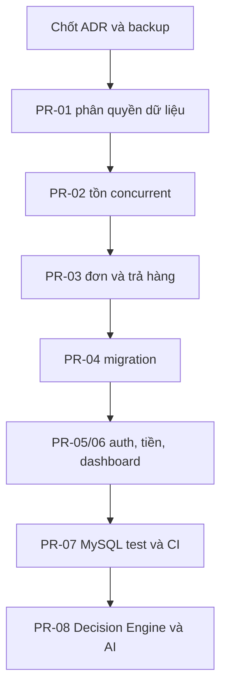

# Kế hoạch sửa và hoàn thiện StockPilot Backend

**Phiên bản:** 1.0 — 23/09/2026  
**Repository:** https://github.com/HuynhAn12/StockPilot_BE  
**Cơ sở kiểm tra:** nhánh mặc định `Sang`, commit `07521edb760d6ccb5fc1d0017a0dcf0844f984ee`.  
**Phạm vi:** kế hoạch kỹ thuật cho backend hiện tại. Đây là đánh giá tĩnh từ code và metadata GitHub; **chưa chạy** build, Jest, migration hoặc MySQL thật, nên không gắn trạng thái PASS cho các hạng mục đó.

## 0. Kết luận và cách sử dụng

Repository đã có Express/TypeScript, Prisma schema, module auth, sản phẩm, kho, đơn, trả hàng, dashboard và test mock. Đây là nền để tiếp tục phát triển. **Chưa deploy/nhận đơn thật:** cập nhật tồn có nguy cơ lost update khi concurrent; staff có thể thấy giá vốn qua API kho; chưa có migration được commit và chưa có bằng chứng test tích hợp trên MySQL. Sửa theo các PR bên dưới, không viết lại toàn bộ repo.

Ký hiệu: **P0** = chặn dữ liệu/bảo mật, **P1** = chặn độ tin cậy triển khai, **P2** = hoàn thiện nghiệp vụ, **P3** = tính năng kế tiếp. Mỗi PR chỉ được đóng khi tiêu chí nghiệm thu tương ứng có kết quả test thực tế.

### Bằng chứng đã kiểm tra

| Phát hiện | Vị trí | Tác động |
|---|---|---|
| Đọc `quantity`, tính `afterQty` rồi `update({quantity: afterQty})` | [`order.service.ts`](https://github.com/HuynhAn12/StockPilot_BE/blob/Sang/src/modules/orders/order.service.ts), [`inventory.service.ts`](https://github.com/HuynhAn12/StockPilot_BE/blob/Sang/src/modules/inventory/inventory.service.ts), [`return.service.ts`](https://github.com/HuynhAn12/StockPilot_BE/blob/Sang/src/modules/returns/return.service.ts) | Lost update, oversell, sai `before/after` trong movement khi concurrent. Transaction hiện tại tự nó không bảo đảm phép đọc–tính–ghi luôn an toàn. |
| Mask chỉ đi qua `items`, `stockItems`, `orderItems`, không đi qua `stockItem` số ít | [`sensitive-fields.ts`](https://github.com/HuynhAn12/StockPilot_BE/blob/Sang/src/common/middleware/sensitive-fields.ts), API [`getBalances/getMovements`](https://github.com/HuynhAn12/StockPilot_BE/blob/Sang/src/modules/inventory/inventory.service.ts) | Staff có thể nhận `stockItem.costPrice`. |
| Refresh token là JWT tự chứa, không có bản hash/phiên ở schema | [`auth.service.ts`](https://github.com/HuynhAn12/StockPilot_BE/blob/Sang/src/modules/auth/auth.service.ts), [`schema.prisma`](https://github.com/HuynhAn12/StockPilot_BE/blob/Sang/prisma/schema.prisma) | Chưa có cơ chế thu hồi/rotation như báo cáo tiến độ mô tả. |
| Chưa có `prisma/migrations/` hay `.github/workflows/` | [Cây file ở commit kiểm tra](https://github.com/HuynhAn12/StockPilot_BE/tree/Sang) | Không tái lập được lịch sử migration; thiếu CI tự động trên commit/PR. |
| Test kho/đơn mock Prisma `$transaction` thành gọi callback | [`inventory.test.ts`](https://github.com/HuynhAn12/StockPilot_BE/blob/Sang/tests/inventory.test.ts), [`order-flow.test.ts`](https://github.com/HuynhAn12/StockPilot_BE/blob/Sang/tests/order-flow.test.ts) | Không kiểm tra khóa, isolation, rollback và hai kết nối cạnh tranh thật. |
| Cấu hình có secret mặc định và server vẫn listen khi DB lỗi | [`env.ts`](https://github.com/HuynhAn12/StockPilot_BE/blob/Sang/src/config/env.ts), [`server.ts`](https://github.com/HuynhAn12/StockPilot_BE/blob/Sang/src/server.ts) | Cấu hình production không hợp lệ có thể vẫn khởi chạy và báo health 200. |
| Giá dùng `Number` trong tính tổng/hoàn/doanh thu, `discountAmount` và `taxAmount` do client nhập | [`order.service.ts`](https://github.com/HuynhAn12/StockPilot_BE/blob/Sang/src/modules/orders/order.service.ts), [`analytics.service.ts`](https://github.com/HuynhAn12/StockPilot_BE/blob/Sang/src/modules/analytics/analytics.service.ts) | Có thể sai làm tròn hoặc cho phép giảm tổng tiền không theo quyền/chính sách. |
| Báo cáo tiến độ nói 100% test trọng yếu và lưu hash refresh token | [`progress-report.md`](https://github.com/HuynhAn12/StockPilot_BE/blob/Sang/docs/progress-report.md) | Chưa được code và dữ liệu CI hiện tại chứng minh; cần sửa mô tả. |

## 1. Cổng thiết kế trước khi sửa schema

**Chỉ cần một buổi chốt với nhóm; ghi quyết định vào `docs/decisions.md`.**

1. **D1–D9:** file flow trước đây định nghĩa D1–D9 theo các vấn đề như thời điểm trừ tồn, doanh thu, trả hàng; `docs/decisions.md` trong repo hiện đã **đổi mã D1–D9 sang các chủ đề khác**. Tạo một bảng đối chiếu hoặc một bộ mã mới duy nhất; sửa `progress-report.md` và `docs/api.md` cho khớp. Không nói “đã duyệt” nếu chưa có biên bản.
2. **Giá khi xác nhận:** repo snapshot giá lúc tạo `DRAFT`; flow đề xuất kiểm tra giá mới khi `CONFIRMED`. Chọn: (a) khóa giá nháp trong khoảng thời gian quy định, hoặc (b) revalidate/cho owner xác nhận lại giá. Không âm thầm đổi giá khách đã thấy.
3. **Số tiền và chiết khấu:** chốt VND nguyên đồng hay Decimal có phần lẻ; ai được đặt discount/tax, mức tối đa và cách kiểm soát. Chốt tiền hoàn theo tỷ lệ/chiết khấu và thuế nếu áp dụng.
4. **Vai trò Admin:** hiện middleware cho Admin đi qua `requireStoreScope` nhưng controller lấy `req.user!.storeId!`; Admin hệ thống có thể có `storeId = null`. Chốt Admin chỉ đi qua endpoint quản trị riêng, phải chọn store theo quyền và ghi audit; không mặc nhiên cho Admin thao tác nghiệp vụ của shop.
5. **Một kho trong MVP:** schema có thể chứa nhiều warehouse để mở rộng, nhưng mọi flow hiện dùng kho mặc định; chốt giới hạn và cách xử lý khi kho bị vô hiệu hóa.

**Đầu ra:** ADR ngắn trong `docs/decisions.md`, bảng trạng thái `Proposed/Approved/Implemented`, người phê duyệt, ngày; cập nhật sơ đồ trạng thái đơn và contract API.

## 2. PR-01 — P0: Bịt lộ trường dữ liệu và siết phân quyền

**Nguyên nhân:** chỉ lọc các tên quan hệ nhất định bằng hàm `maskSensitiveFields`; `stockItem` số ít trong balance/movement không được xử lý. Các API kho trả đối tượng Prisma lồng sâu. Middleware xác thực chỉ tin role/store trong JWT cho tới lúc hết hạn; tài khoản bị khóa hoặc chuyển store vẫn có thể dùng access token cũ trong khoảng hiệu lực.

**Thay đổi:**

- Sửa `inventory.service.ts` để `select` chính xác trường cần cho staff, tách DTO/API response cho Owner và Staff. Làm tương tự ở product, order, return; bỏ việc lấy toàn bộ record rồi xóa vài trường. Có thể giữ mask phụ trợ nhưng không coi nó là tuyến bảo vệ duy nhất.
- Rà `inventory.routes.ts`, `orders.routes.ts`, `returns.routes.ts`: quy định quyền theo **từng thao tác** (xem, nhập, xuất, kiểm kê, xác nhận, hoàn thành, hủy, trả), không chỉ `requireStoreScope`.
- Rà các truy vấn đối tượng theo ID luôn có store scope từ backend; Admin dùng tuyến quản trị riêng. Kiểm tra `isActive`, membership/store tại điểm thích hợp; có thể dùng `tokenVersion`/session khi cần vô hiệu hóa tức thời.
- Mọi filter/query numeric (`id`, `limit`, `warehouseId`) phải validate trước khi dùng; giới hạn `limit` và phân trang list.

**File chính:** `src/common/middleware/{auth,rbac,sensitive-fields}.ts`, `src/modules/{inventory,products,orders,returns,users}/**`, `prisma/schema.prisma` nếu thêm session/version.

**Test phải chạy:** Staff gọi HTTP `GET /inventory/balances`, `GET /inventory/movements`, `GET /products`, `GET /orders/:id` và kiểm tra đệ quy JSON không có giá vốn; Owner vẫn thấy trường có quyền; dùng ID của store khác phải bị từ chối; Staff không gọi được thao tác kiểm kê/đổi giá ngoài quyền; user khóa không dùng được token theo chính sách đã ghi.

**Nghiệm thu:** không có `costPrice`, `costPriceSnapshot`, biên lợi nhuận hoặc thông tin tương đương trong bất kỳ response Staff nào; các ca cross-store pass.

## 3. PR-02 — P0: Viết lại phép đổi tồn an toàn khi concurrent

**Nguyên nhân:** `findUnique` → tính số mới trong JS → `update` có thể dùng số đọc cũ khi transaction khác vừa thay đổi balance. Mọi luồng dùng cùng số dư cần đi qua **một cơ chế cập nhật chung**.

**Thiết kế triển khai:**

1. Thêm `src/modules/inventory/stock-ledger.service.ts` hoặc hàm repository chung nhận transaction `tx`, `storeId`, `warehouseId`, `stockItemId`, `delta`, `sourceType`, `sourceLineId`, `idempotencyKey`, `actorId`.
2. Với giảm tồn, dùng update có điều kiện theo khóa duy nhất của balance: `quantity >= requested` và giảm bằng atomic decrement; kiểm tra số dòng cập nhật bằng 1. Với tăng tồn, atomic increment; khi row chưa tồn tại, xử lý cạnh tranh create bằng unique `(warehouseId, stockItemId)` và retry có giới hạn. Có thể dùng `SELECT ... FOR UPDATE` trong transaction nếu cần `before/after` chính xác; tránh `SKIP LOCKED` cho nghiệp vụ bán hàng.
3. Lock/update các SKU trong **thứ tự ID ổn định**; gộp SKU trùng trong một request trước khi trừ. Sau thay đổi, ghi movement với `before/after` lấy từ cùng transaction và một source line duy nhất. Không cho ứng dụng bên ngoài cập nhật balance trực tiếp.
4. Chuẩn hóa unique key cho movement nguồn nghiệp vụ, ví dụ `store + sourceType + sourceLineId + movementType`; một phiếu nhập nhiều SKU phải có `sourceLineId` khác nhau. Khóa request idempotency riêng theo `store + operation + key` với payload hash, để cùng key khác payload trả 409.
5. Giữ transaction ngắn; retry **toàn bộ** transaction khi gặp deadlock/write conflict theo đúng loại lỗi của Prisma 5/MySQL. Không retry từng câu lệnh sau khi transaction đã thất bại.
6. Đối soát `inventory_balance.quantity` với opening stock + tổng movement; mọi sửa chênh lệch dùng adjustment mới có audit, không sửa movement cũ.

**File chính:** `inventory.service.ts`, `order.service.ts`, `return.service.ts`, `prisma/schema.prisma` và migration bổ sung constraints.

**Test MySQL thật:**

- Tồn 1, hai đơn khác nhau cùng xác nhận 1 đơn vị: đúng **một** thành công, một báo thiếu tồn/xung đột; tồn 0, một movement giảm.
- Hai lần xác nhận **cùng đơn**: một lần trừ, lần còn lại trả kết quả cũ hoặc 409 nhất quán; không có movement thứ hai.
- Hai phiếu nhập/điều chỉnh đồng thời cùng SKU: balance cuối bằng tổng delta, trước/sau movement liên tục theo thứ tự commit.
- Bất kỳ lỗi tạo movement nào phải rollback update balance/đơn.
- Request gồm SKU lặp phải gộp hoặc bị từ chối, không trừ hai lần ngoài ý muốn.

**Nghiệm thu:** test concurrent chạy lặp nhiều vòng trên MySQL InnoDB; balance đối soát với ledger, không âm và không lost update. Tài liệu MySQL về locking/deadlock và Prisma transaction là nguồn tham khảo; kết quả thực tế phải chứng minh bằng integration test.

## 4. PR-03 — P0: Khóa trạng thái đơn và tránh trả hàng vượt lượng

**Nguyên nhân:** code kiểm tra `status` hoặc tổng số đã trả rồi ghi tiếp, nhưng hai request song song có thể cùng đọc trạng thái/tổng cũ. `fulfillOrder` đọc rồi update ngoài transaction. Request return có thể gửi cùng `orderItemId` nhiều lần; `previousReturnsMap` hiện không tăng theo các dòng ngay trong request.

**Thay đổi:**

- Chuyển `DRAFT → CONFIRMED`, `CONFIRMED → FULFILLED`, `DRAFT/CONFIRMED → CANCELED` bằng kiểm tra trạng thái trong **cùng transaction** với cập nhật dữ liệu liên quan; dùng conditional `updateMany` theo `id, storeId, status` hoặc khóa dòng order và kiểm tra count. Với hủy đã xác nhận, hoàn đúng movement nguồn ban đầu một lần.
- Tạo return gắn với order gốc; khóa/order guard trước khi tính tổng đã trả, gộp `orderItemId` lặp trong payload hoặc báo 400; cập nhật số lượng được trả nguyên tử hoặc khóa dòng đơn tương ứng. Chặn `sum(previous + current) > sold` kể cả hai request song song.
- Nếu restock, return record, refund đã ghi sổ, movement và balance phải cùng transaction. Trả lại cùng idempotency key không tạo phiếu mới.
- Với `CONFIRMED` không có kho mặc định/balance khi hủy, báo lỗi và rollback; tuyệt đối không chuyển `CANCELED` rồi bỏ qua bước hoàn tồn. Không cho hoàn thành đơn đã bị hủy.
- Sửa tên movement `ORDER_FULFILL` nếu thực tế trừ ở `CONFIRMED`, ví dụ `ORDER_CONFIRM_DEDUCT`, bằng migration và API docs nếu cần.

**File chính:** `order.service.ts`, `return.service.ts`, schema + migration + test.

**Test MySQL thật:** hai lần hủy/xác nhận/fulfill đồng thời; hai return đồng thời cùng 1 dòng đơn; một payload lặp `orderItemId`; lỗi tại bước ghi refund/movement; đơn đã completed không hủy. Đối chiếu tồn, số trả và doanh thu sau từng tình huống.

**Nghiệm thu:** trạng thái hợp lệ, mỗi lần trừ/hoàn đúng một lần, số trả tích lũy không vượt số đã bán.

## 5. PR-04 — P1: Migration, ràng buộc DB và dữ liệu mẫu

**Nguyên nhân:** hiện có `prisma/schema.prisma` nhưng không có `prisma/migrations/` trong commit; tài liệu dùng `db push` và `migrate dev` như hai con đường tương đương. Quan hệ `storeId` trên các bảng con không tự bảo đảm FK trỏ tới Product/Order/Warehouse thuộc đúng store; nhiều `onDelete: Cascade` có thể xóa lịch sử giao dịch nếu cho xóa parent.

**Thay đổi:**

- Chọn schema hiện tại làm baseline **chỉ khi DB đang trống**; nếu đã có DB của nhóm, lập kế hoạch baseline/data migration thay vì chạy reset. Tạo migration versioned, commit SQL được sinh, kiểm tra `migrate deploy` trên DB sạch và DB đã có migration trước đó.
- Bổ sung constraints cần thiết: SKU unique theo store; `quantity >= 0`, số lượng dòng đơn/return dương, giá/tổng không âm bằng DB constraint phù hợp với MySQL/Prisma migration SQL; unique idempotency/source line; index theo truy vấn `storeId + status + timestamp`.
- Đảm bảo các ID liên quan cùng store bằng service checks trong transaction và ràng buộc dữ liệu khả thi; chặn hard delete đối tượng đã có lịch sử. Rà `onDelete: Cascade` với OrderItem, StockMovement, Return; ưu tiên archive/disable sản phẩm, category, store.
- Nếu MVP thật sự một kho/store, thêm quy tắc/tác vụ tạo default warehouse duy nhất; tránh cho client tùy ý dùng một kho khác của store nếu nghiệp vụ chưa duyệt.
- Seed chỉ tạo dữ liệu demo trong môi trường development; không đưa password/secret mẫu vào production.

**File chính:** `prisma/schema.prisma`, `prisma/migrations/**`, `prisma/seed.ts`, `docs/database.md`, `README.md`.

**Nghiệm thu:** dựng MySQL mới → `npm ci` → `prisma generate` → `prisma migrate deploy` → build/test; migration không đòi xóa bảng dữ liệu sẵn có. Có bản backup trước mọi migration trên DB chung.

## 6. PR-05 — P1: Auth, biến môi trường, health và phạm vi Admin

- `env.ts`: production bắt buộc `DATABASE_URL`, secret đủ mạnh và `CORS_ORIGIN` cụ thể; không dùng default JWT secret. `.env.example` dùng placeholder, không dùng secret mẫu như production.
- `auth.service.ts`, `jwt.ts`, `schema.prisma`: chốt access/refresh token; nếu cần logout, đổi mật khẩu, khóa tài khoản có hiệu lực ngay thì lưu **hash** refresh token/session, rotate khi refresh và chặn reuse. Không lưu token thô. Rà token version/DB active membership theo chính sách.
- `server.ts`: kết nối DB trước khi sẵn sàng nhận lưu lượng; thất bại thì exit non-zero hoặc readiness báo fail. `/health/live` cho process, `/health/ready` thử phụ thuộc DB với timeout hợp lý. Graceful shutdown SIGTERM/SIGINT.
- `rbac.ts`: Admin không đi vào API shop với `storeId = null`; endpoint quản trị lấy store theo path/parameter đã validate và có audit; tránh query vô tình không còn filter theo store.
- Giới hạn kích thước JSON body, rate limit cho login/refresh, xử lý lỗi production không lộ stack trace; kiểm tra CORS tương ứng frontend thật.

**Test:** thiếu secret ở production thì không khởi động; DB mất kết nối thì readiness fail; khóa user/token cũ theo policy; refresh lặp/replay; role Admin không vô tình xem/sửa dữ liệu toàn hệ thống qua API shop.

## 7. PR-06 — P1: Tiền, API input và dashboard

- Dùng `Prisma.Decimal` (hoặc số nguyên đồng VND nếu nhóm chốt) **xuyên suốt** phép tính tiền; tránh `toNumber()` → cộng/trừ float → `toDecimal()` cho giá, total, refund. Xác định quy tắc làm tròn duy nhất và ghi trong `docs/decisions.md`.
- `discountAmount`/`taxAmount` trong `createOrderSchema` hiện do client nhập; tạm khóa theo role/chính sách hoặc để server tính. Test gửi discount lớn hơn subtotal/giá âm/NaN/Infinity; không dùng `Math.max(0, ...)` để âm thầm che lỗi giá.
- Dashboard dùng aggregate ở DB thay vì tải toàn bộ `fulfilledOrders`, `returns`, `balances` lên Node; hỗ trợ `from/to`, múi giờ store, thời điểm ghi nhận, phân trang/export. Không dùng `Math.max(0, gross-refunds)` nếu phép tính ròng thực tế có thể âm trong kỳ báo cáo.
- Kiểm tra SKU lặp khi tạo sản phẩm, trùng trong một payload đơn/nhập/trả; DB unique vẫn là tuyến bảo vệ cuối cùng. Dùng mã đơn/return chống collision bằng DB constraint + retry có giới hạn.

**Test:** tiền có số lẻ/giảm giá/return một phần; báo cáo nhiều kỳ có hàng trả của đơn kỳ trước; dữ liệu đủ lớn để đo p95 dưới mục tiêu 2 giây **trong môi trường được mô tả**, không gắn nhãn đạt nếu chưa đo.

## 8. PR-07 — P1: Bộ kiểm thử thật, CI và tài liệu trung thực

**Tầng test:**

1. Unit test: service validation, state transitions, DTO và công thức thuần. Mock hợp lý ở đây nhưng không dùng để khẳng định atomicity.
2. Integration test với MySQL 8.4 chạy qua migrations: đăng ký owner/store/kho, cross-store, dòng tiền, movement/balance, rollback, concurrent order/returns, endpoint Staff không lộ giá vốn.
3. API smoke test sau deploy trên môi trường staging: login, tạo SKU, nhập 1, hai request mua cùng lúc, trả hàng, dashboard, readiness.

**CI đề xuất:** `.github/workflows/backend-ci.yml` trigger push/PR, `setup-node` theo phiên bản dự án, MySQL service container, `npm ci`, generate, validate, migrate deploy, `npm run build`, `npm test`; secrets test chỉ dùng dữ liệu giả. Thêm lint nếu repo bổ sung ESLint/Prettier. Không cần chạy test MySQL thật cho từng unit test, nhưng PR không được pass nếu suite integration lỗi.

**Chỉnh tài liệu:** README ghi rõ chạy từ root repo (repo hiện là backend trực tiếp, không có thư mục `backend/` như README minh họa); bỏ phát biểu “100% test trọng yếu” và “refresh hash trong DB” khỏi `progress-report.md` cho tới khi có mã/test tương ứng; ghi môi trường, commit SHA, lệnh chạy, kết quả thật và giới hạn kiểm thử.

**Nghiệm thu:** CI xanh trên PR; reviewer đọc logs; test concurrent thực sự chạy hai kết nối DB; DB sạch dựng được bằng migration. Không ép `--forceExit` để che handle đang mở nếu có thể sửa teardown.

## 9. PR-08 — P2/P3: Xây tính năng còn thiếu theo proposal

Chỉ mở sau khi PR-01 đến PR-07 đạt các cổng chất lượng.

| Thành phần | Nhiệm vụ | Điều kiện nghiệm thu |
|---|---|---|
| Sales analytics & reports | Doanh thu theo kỳ, sales velocity từ đơn FULFILLED trừ lượng trả theo quy tắc đã duyệt; export an toàn. | Tái tạo được số liệu từ đơn và return gốc. |
| Decision Engine | Hàm TypeScript thuần nhận snapshot (`as_of`, engine_version); tính days of cover, reorder point và quy tắc slow-moving theo ngưỡng được nhóm chốt. | Trả `INSUFFICIENT_DATA` khi thiếu dữ liệu; giải thích được từng factor; fixture kiểm chứng thủ công. |
| Smart Alerts | Lưu alert theo store/SKU/type/window/version, priority, trạng thái; job tính lại idempotent. | Không spam duplicate, kết quả stale được đánh dấu khi dữ liệu đổi. |
| Pricing | Giá sàn theo cost/margin, đề xuất có giới hạn, audit ACCEPT/REJECT/MODIFY, revalidate giá khi Owner duyệt. | Job không tự đổi giá; không áp dụng đề xuất cũ sau khi cost/price thay đổi. |
| AI Assistant | Query đọc được phép theo store/field ACL, context nhỏ và có timestamp; Responses API chỉ diễn giải, không có tool ghi. | Thử prompt injection trong tên sản phẩm và câu hỏi; hạn mức, timeout, chi phí và chính sách lưu giữ dữ liệu. |
| CSV/Excel import | Preview lỗi từng dòng, import batch idempotent, phân biệt đơn lịch sử và tồn mở đầu. | Import lại không trừ tồn hai lần; export tránh formula injection. |

**Không gọi thuật toán “AI dự báo chính xác” hoặc giá “tối ưu” cho tới khi có bộ dữ liệu, baseline, cách đo và đánh giá với người dùng nghiệp vụ.**

## 10. Lộ trình làm việc và cổng nghiệm thu



| Cổng | Điều kiện để chuyển |
|---|---|
| G0 | Nhóm duyệt các quy tắc có tác động DB/API; snapshot/backup DB nếu đã có dữ liệu. |
| G1 | Staff không xem được cost; cross-store test pass; route ghi kho/đơn có quyền cụ thể. |
| G2 | Test MySQL concurrent chứng minh không oversell, không lost update, không return vượt; ledger đối soát. |
| G3 | DB mới dựng từ migrations, build/test trong CI, staging smoke pass. |
| G4 | Mới triển khai logic alert/pricing/AI và đánh giá hiệu quả với dữ liệu mẫu. |

**Phân công gợi ý cho nhóm 5 người:** một người phụ trách DB/migrations và review transaction; một người sửa inventory/order; một người auth/RBAC/DTO; một người test MySQL/CI; một người business rules/tài liệu và kiểm thử luồng. Tất cả thay đổi kho/đơn phải có ít nhất một review chéo; không merge PR chứa migration chưa thử trên bản sao DB.

## 11. Lệnh kiểm chứng để nhóm chạy sau khi sửa

```bash
# Chạy tại root repo, sau khi cấu hình MySQL test riêng
npm ci
npx prisma validate
npx prisma generate
npx prisma migrate deploy
npm run build
npm test
```

Chạy integration suite trong CI với MySQL service; trên máy Windows PowerShell cần tạo `.env` phù hợp trước. Đây là **lệnh đề xuất để chạy**, không phải kết quả đã thực hiện. Chỉ dùng `prisma migrate dev` khi tạo migration trong môi trường phát triển; deploy môi trường khác bằng migration đã được commit. Nếu đã có DB chứa dữ liệu, backup và kiểm tra chênh lệch schema trước, không dùng `db push` để thay lịch sử migration.

## 12. Nguồn kỹ thuật và giới hạn

- Mã nguồn đã kiểm tra: repository và commit ghi ở đầu file; lỗi xác định dựa trên mã nguồn, chưa có bằng chứng thực nghiệm trên MySQL.
- MySQL 8.4 — locking reads: https://dev.mysql.com/doc/refman/8.4/en/innodb-locking-reads.html
- MySQL 8.4 — deadlock handling: https://dev.mysql.com/doc/refman/8.4/en/innodb-deadlocks-handling.html
- Prisma transaction: https://www.prisma.io/docs/orm/prisma-client/queries/transactions (đối chiếu **Prisma 5.22.0** đang khai báo trong repo trước khi áp dụng ví dụ từ tài liệu phiên bản mới).
- OWASP API1 và API3: https://api-security.owasp.org/editions/2023/en/0xa1-broken-object-level-authorization/ ; https://api-security.owasp.org/editions/2023/en/0xa3-broken-object-property-level-authorization/
- GitHub Actions Node.js: https://docs.github.com/en/actions/tutorials/build-and-test-code/nodejs

**Quyết định cần người phụ trách xác nhận:** flow giá khi xác nhận, chính sách discount/tax/return, quyền Admin, thời gian hiệu lực JWT, tiền tệ/làm tròn và ngưỡng Decision Engine. Kế hoạch này không tự coi những lựa chọn chưa duyệt là yêu cầu chính thức.
