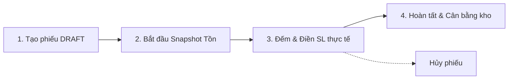

 # STOCKPILOT - TÀI LIỆU BÀN GIAO TÍCH HỢP FRONTEND (API HANDOVER DOCUMENT)

> **Dự án**: StockPilot Backend (Quản lý kho & Bán hàng đa kênh / POS)  
> **Phiên bản API**: `v1.0.0` (Production Hardening)  
> **Base URL Development**: `http://localhost:3000/api/v1`  
> **Múi giờ chuẩn**: `Asia/Ho_Chi_Minh` (GMT+7)  
> **Cập nhật lần cuối**: 02/10/2026  
> **Git Repository**: [https://github.com/HuynhAn12/StockPilot_BE.git](https://github.com/HuynhAn12/StockPilot_BE.git) (Branch: `Sang`)

---

## MỤC LỤC

1. [Tổng quan kiến trúc & Cấu hình môi trường](#1-tổng-quan-kiến-trúc--cấu-hình-môi-trường)
2. [Quy chuẩn Request / Response & Headers](#2-quy-chuẩn-request--response--headers)
3. [Phân quyền & Vai trò (RBAC)](#3-phân-quyền--vai-trò-rbac)
4. [Danh mục API chi tiết theo phân hệ](#4-danh-mục-api-chi-tiết-theo-phân-hệ)
   - [4.1 Xác thực & Tài khoản (Auth & Users)](#41-xác-thực--tài-khoản-auth--users)
   - [4.2 Cấu hình thanh toán cửa hàng (PayOS Config)](#42-cấu-hình-thanh-toán-cửa-hàng-payos-config)
   - [4.3 Bán hàng tại quầy (POS - Point of Sale)](#43-bán-hàng-tại-quầy-pos---point-of-sale)
   - [4.4 Danh mục & Sản phẩm (Categories & Products)](#44-danh-mục--sản-phẩm-categories--products)
   - [4.5 Quản lý Tồn kho & Sổ cái (Inventory)](#45-quản-lý-tồn-kho--sổ-cái-inventory)
   - [4.6 Quy trình Kiểm kho (Stock Takes)](#46-quy-trình-kiểm-kho-stock-takes)
   - [4.7 Đơn hàng & Đổi trả (Orders & Returns)](#47-đơn-hàng--đổi-trả-orders--returns)
   - [4.8 Báo cáo Thống kê & Trợ lý AI (Analytics, Decision Engine, Assistant)](#48-báo-cáo-thống-kê--trợ-lý-ai-analytics-decision-engine-assistant)
   - [4.9 Nhập xuất dữ liệu (Import / Export CSV & Excel)](#49-nhập-xuất-dữ-liệu-import--export-csv--excel)
   - [4.10 Thông báo (Notifications)](#410-thông-báo-notifications)
5. [Hướng dẫn tích hợp luồng nghiệp vụ chính (Frontend Recipes)](#5-hướng-dẫn-tích-hợp-luồng-nghiệp-vụ-chính-frontend-recipes)
6. [Bảng mã lỗi (Error Codes) & Xử lý ngoại lệ](#6-bảng-mã-lỗi-error-codes--xử-lý-ngoại-lệ)

---

## 1. TỔNG QUAN KIẾN TRÚC & CẤU HÌNH MÔI TRƯỜNG

### 1.1 Multi-Tenant (Đa cửa hàng)
Backend hỗ trợ định danh Tenant thông qua:
1. **Subdomain**: `https://{storeCode}.stockpilot.vn/api/v1/...`
2. **Custom Header**: `X-Tenant-Slug: {storeCode}` (Rất tiện khi chạy localhost / dev)
3. **Mặc định**: Nếu gọi từ localhost và không truyền header, hệ thống sẽ map theo `storeId` của người dùng đã đăng nhập trong JWT Access Token.

### 1.2 Khởi động Backend tại máy Local (cho bạn FE test)
```bash
# Clone repo & chuyển sang branch Sang
git clone https://github.com/HuynhAn12/StockPilot_BE.git
cd StockPilot_BE/backend
git checkout Sang

# Cài đặt dependencies
npm install

# Tạo file .env từ .env.example
cp .env.example .env

# Chạy migration DB (MySQL 8)
npx prisma migrate deploy

# Khởi động server dev (Port 3000)
npm run dev
```

---

## 2. QUY CHUẨN REQUEST / RESPONSE & HEADERS

### 2.1 Headers bắt buộc
| Header | Giá trị / Ý nghĩa | Bắt buộc khi nào |
|---|---|---|
| `Content-Type` | `application/json` | Cho tất cả request `POST`, `PUT`, `PATCH` |
| `Authorization` | `Bearer <accessToken>` | Cho tất cả API cần đăng nhập |
| `Idempotency-Key` | UUIDv4 (vd: `9b1deb4d-3b7d-4bad-9bdd-2b0d7b3dcb6d`) | **Bắt buộc** với các API giao dịch: tạo đơn hàng, thanh toán POS, chốt kiểm kho, import dữ liệu |
| `X-Tenant-Slug` | `{storeCode}` (tùy chọn) | Khi gọi dev localhost đa cửa hàng |

### 2.2 Định dạng Response chuẩn

#### Phản hồi thành công (2xx)
```json
{
  "success": true,
  "data": {
    "id": 1,
    "name": "Sản phẩm A"
  }
}
```

#### Phản hồi lỗi (4xx / 5xx)
```json
{
  "success": false,
  "error": {
    "code": "VALIDATION_ERROR",
    "message": "Dữ liệu đầu vào không hợp lệ",
    "details": {
      "field": "items",
      "issue": "Mảng sản phẩm không được rỗng"
    },
    "requestId": "e14b537d-5c82-45e6-99cf-0ff92cf7d5c9"
  }
}
```

---

## 3. PHÂN QUYỀN & VAI TRÒ (RBAC)

Hệ thống có 2 Role chính:
- `SHOP_OWNER` (Chủ cửa hàng): Toàn quyền quản lý cửa hàng, cấu hình thanh toán PayOS, quản lý nhân viên, xem báo cáo doanh thu & giá vốn, điều chỉnh giá.
- `WAREHOUSE_STAFF` (Nhân viên bán hàng / Thủ kho): Thực hiện bán hàng tại quầy (POS), kiểm kho, xuất/nhập kho, xem danh sách sản phẩm (ẩn giá vốn), xem thông báo.

---

## 4. DANH MỤC API CHI TIẾT THEO PHÂN HỆ

### 4.1 Xác thực & Tài khoản (Auth & Users)

| Method | Endpoint | Quyền | Mô tả & Body |
|---|---|---|---|
| `POST` | `/auth/register` | Public | Đăng ký tài khoản Shop Owner & Tạo cửa hàng mới. <br>Body: `{ fullName, email, password, storeName, storeCode, phone?, address? }` |
| `POST` | `/auth/login` | Public | Đăng nhập hệ thống. Trả về `{ accessToken, refreshToken, user: { id, email, role, storeId, storeCode } }` |
| `POST` | `/auth/refresh` | Public | Cấp lại access token mới. Body: `{ refreshToken }` |
| `POST` | `/auth/forgot-password` | Public | Gửi yêu cầu reset mật khẩu. Body: `{ email }` |
| `POST` | `/auth/reset-password` | Public | Đặt lại mật khẩu. Body: `{ token, newPassword }` |
| `POST` | `/auth/logout` | Bearer | Đăng xuất, hủy session refresh token. Body: `{ refreshToken? }` |
| `GET` | `/auth/me` | Bearer | Lấy thông tin user hiện tại đang đăng nhập. |
| `PATCH` | `/auth/me` | Bearer | Cập nhật thông tin cá nhân. Body: `{ fullName }` |
| `GET` | `/users` | `SHOP_OWNER` | Lấy danh sách nhân viên trong cửa hàng. |
| `POST` | `/users` | `SHOP_OWNER` | Tạo tài khoản nhân viên kho (`WAREHOUSE_STAFF`). Body: `{ fullName, email, password }` |
| `PATCH` | `/users/:id` | `SHOP_OWNER` | Khóa/Mở khóa hoặc đổi tên nhân viên. Body: `{ fullName?, isActive? }` |

---

### 4.2 Cấu hình thanh toán cửa hàng (PayOS Config)

Dành cho màn hình **Cài đặt cửa hàng -> Cổng thanh toán**:

| Method | Endpoint | Quyền | Mô tả |
|---|---|---|---|
| `GET` | `/store/payment-config/payos` | `SHOP_OWNER` | Xem trạng thái cấu hình PayOS của shop. <br>Response: `{ provider: "PAYOS", configured: true/false, active: true/false, clientIdMasked: "client_***" }` |
| `PUT` | `/store/payment-config/payos` | `SHOP_OWNER` | Lưu thông tin tích hợp PayOS. <br>Body: `{ clientId, apiKey, checksumKey, isActive? }` *(Lưu ý: Backend tự động mã hóa AES-256-GCM)* |
| `POST` | `/store/payment-config/payos/deactivate` | `SHOP_OWNER` | Tạm ngắt kích hoạt cổng PayOS của shop. |

---

### 4.3 Bán hàng tại quầy (POS - Point of Sale)

Dành cho giao diện **Thu ngân / Bán lẻ tại quầy**:

#### API Tạo đơn & Thanh toán tại quầy: `POST /pos/sales`
- **Quyền**: `SHOP_OWNER`, `WAREHOUSE_STAFF`
- **Header**: `Idempotency-Key: <UUID>` *(Bắt buộc để tránh quẹt trùng đơn)*
- **Request Body**:
```json
{
  "warehouseId": 1,
  "customerName": "Khách lẻ - Anh Hùng",
  "customerPhone": "0987654321",
  "discountAmount": 10000,
  "taxAmount": 0,
  "note": "Khách thanh toán chuyển khoản",
  "paymentMethod": "CASH",
  "items": [
    {
      "stockItemId": 12,
      "quantity": 2
    },
    {
      "stockItemId": 15,
      "quantity": 1
    }
  ]
}
```
- **Hỗ trợ `paymentMethod`**: `CASH` (Tiền mặt), `BANK_TRANSFER` (Chuyển khoản), `PAYOS`, `MOMO`.
- **Response trả về**:
```json
{
  "success": true,
  "data": {
    "receipt": {
      "receiptNumber": "REC-20261002-0001",
      "orderCode": "ORD-20261002-0012",
      "storeName": "Cửa hàng Thời trang StockPilot",
      "cashierName": "Nguyễn Văn A",
      "createdAt": "2026-10-02T12:00:00.000Z",
      "items": [
        { "name": "Áo Thun Polo Trắng (Size L)", "quantity": 2, "unitPrice": 250000, "total": 500000 }
      ],
      "subtotal": 500000,
      "discountAmount": 10000,
      "totalAmount": 490000,
      "paymentMethod": "CASH",
      "paymentStatus": "PAID"
    }
  }
}
```
*(FE có thể dùng thẳng object `receipt` này để render template In Hóa Đơn ra máy in nhiệt 80mm hoặc 58mm).*

---

### 4.4 Danh mục & Sản phẩm (Categories & Products)

| Method | Endpoint | Quyền | Mô tả |
|---|---|---|---|
| `GET` | `/categories` | Tất cả | Danh sách danh mục (hỗ trợ phân trang: `?page=1&limit=20`) |
| `POST` | `/categories` | `SHOP_OWNER` | Tạo danh mục mới. Body: `{ name, code, description? }` |
| `PUT` | `/categories/:id` | `SHOP_OWNER` | Sửa danh mục. Body: `{ name?, description?, isActive? }` |
| `DELETE` | `/categories/:id` | `SHOP_OWNER` | Xóa mềm danh mục. |
| `GET` | `/products` | Tất cả | Lấy danh sách sản phẩm & biến thể SKU, tồn kho hiện tại, bộ lọc theo danh mục / keyword. |
| `GET` | `/products/:id` | Tất cả | Xem chi tiết 1 sản phẩm kèm các biến thể (Stock Items). |
| `POST` | `/products` | `SHOP_OWNER` | Tạo sản phẩm mới kèm các biến thể. <br>Body: `{ categoryId, name, code, description?, items: [{ sku, barcode, costPrice, sellingPrice, minStockLevel }] }` |
| `PUT` | `/products/:id` | `SHOP_OWNER` | Cập nhật thông tin chung sản phẩm. |

---

### 4.5 Quản lý Tồn kho & Sổ cái (Inventory)

| Method | Endpoint | Quyền | Mô tả |
|---|---|---|---|
| `GET` | `/inventory/balances` | Tất cả | Xem số dư tồn kho tức thời theo từng SKU / Kho hàng (`?warehouseId=&sku=`). |
| `GET` | `/inventory/movements` | Tất cả | Xem lịch sử thẻ kho (Stock Ledger) ghi nhận mọi biến động nhập, xuất, bán, trả, kiểm kê. |
| `POST` | `/inventory/inflow` | Tất cả | Nhập kho thủ công / Nhập hàng NCC. Header: `Idempotency-Key`. Body: `{ warehouseId, items: [{ stockItemId, quantity }], note? }` |
| `POST` | `/inventory/outflow` | Tất cả | Xuất kho (hủy hàng, hao hụt, xuất nội bộ). Header: `Idempotency-Key`. Body: `{ warehouseId, items: [{ stockItemId, quantity }], note? }` |

---

### 4.6 Quy trình Kiểm kho (Stock Takes)

Quy trình chuẩn 4 bước dành cho màn hình **Kiểm kê kho**:



1. **Bước 1: Tạo phiếu DRAFT**
   - `POST /stock-takes`
   - Body: `{ "warehouseId": 1, "note": "Kiểm kê định kỳ tháng 10" }`
2. **Bước 2: Bắt đầu kiểm đếm (Chụp snapshot tồn lý thuyết)**
   - `POST /stock-takes/:id/start`
   - Hệ thống tự động snapshot số lượng tồn hệ thống tại thời điểm bấm kiểm.
3. **Bước 3: Nhập số lượng thực tế kiểm được**
   - `PUT /stock-takes/:id/counts`
   - Body: `{ "items": [{ "stockItemId": 10, "countedQuantity": 95, "note": "Lệch 5 cái do rách" }] }`
4. **Bước 4: Chốt cân bằng kho**
   - `POST /stock-takes/:id/complete`
   - Hệ thống tự động sinh bút toán chênh lệch tồn vào sổ cái kho để số tồn trên hệ thống khớp với số đếm.
5. *(Tùy chọn) Hủy phiếu*: `POST /stock-takes/:id/cancel`

---

### 4.7 Đơn hàng & Đổi trả (Orders & Returns)

| Method | Endpoint | Quyền | Mô tả |
|---|---|---|---|
| `GET` | `/orders` | Tất cả | Danh sách đơn hàng (`?status=&from=&to=&page=1&limit=20`). |
| `GET` | `/orders/:id` | Tất cả | Chi tiết đơn hàng. |
| `POST` | `/orders` | `SHOP_OWNER` | Tạo đơn hàng bán buôn / trực tuyến. Header: `Idempotency-Key`. |
| `POST` | `/orders/:id/confirm` | `SHOP_OWNER` | Xác nhận đơn hàng (giữ tồn kho). |
| `POST` | `/orders/:id/fulfill` | Tất cả | Đóng gói và xuất giao đơn hàng. |
| `POST` | `/orders/:id/cancel` | `SHOP_OWNER` | Hủy đơn hàng và hoàn trả tồn kho. Body: `{ cancelReason }` |
| `POST` | `/returns` | `SHOP_OWNER` | Tạo phiếu đổi/trả hàng. Body: `{ orderId, reason, items: [{ orderItemId, quantity, isRestockable: true }] }` |

---

### 4.8 Báo cáo Thống kê & Trợ lý AI (Analytics, Decision Engine, Assistant)

| Method | Endpoint | Quyền | Mô tả |
|---|---|---|---|
| `GET` | `/analytics/dashboard` | `SHOP_OWNER` | Dữ liệu tổng quan: Doanh thu, số đơn, giá trị tồn kho, cảnh báo hết hàng (`?timeframe=today/week/month`). |
| `GET` | `/decision-engine/overview` | Tất cả | Tổng quan đánh giá rủi ro hàng tồn, nguy cơ tồn kho ứ đọng, hàng bán chạy. |
| `GET` | `/decision-engine/sku/:stockItemId` | Tất cả | Phân tích chi tiết chu kỳ bán, vận tốc bán, ngày tồn kho còn lại của 1 SKU. |
| `GET` | `/alerts` | Tất cả | Danh sách cảnh báo thông minh (Hàng sắp hết, Hàng cận date, Tồn kho quá ngưỡng). |
| `POST` | `/alerts/:id/resolve` | Tất cả | Đánh dấu đã xử lý cảnh báo. |
| `GET` | `/pricing` | Tất cả | Gợi ý điều chỉnh giá bán tối ưu để kích cầu hoặc tối ưu biên lợi nhuận. |
| `POST` | `/pricing/:id/accept` | `SHOP_OWNER` | Chấp nhận giá đề xuất và tự động cập nhật giá sản phẩm (`{ applyToStockItem: true }`). |
| `GET` | `/assistant/sku/:stockItemId` | Tất cả | AI Assistant giải thích tình trạng SKU và đưa ra lời khuyên bằng ngôn ngữ tự nhiên. |
| `GET` | `/assistant/overview` | Tất cả | AI Assistant tóm tắt toàn bộ sức khỏe kinh doanh của cửa hàng. |

---

### 4.9 Nhập xuất dữ liệu (Import / Export CSV & Excel)

- **Import 2 bước an toàn (Preview -> Commit)**:
  1. `POST /import/preview` hoặc `POST /historical-sales/preview`: Upload mảng dữ liệu hoặc file để kiểm tra validate từng dòng, phát hiện lỗi trước khi lưu.
  2. `POST /import/commit` hoặc `POST /historical-sales/commit`: Body `{ jobId }` để lưu chính thức vào DB.
- **Export CSV chuẩn UTF-8**:
  - `GET /export/products`
  - `GET /export/inventory`
  - `GET /export/orders`
  - `GET /export/sales`
  - `GET /export/decision-report`

---

### 4.10 Thông báo (Notifications)

| Method | Endpoint | Quyền | Mô tả |
|---|---|---|---|
| `GET` | `/notifications` | Tất cả | Lấy danh sách thông báo của user hiện tại (`?isRead=false&page=1&limit=20`). |
| `POST` | `/notifications/:id/read` | Tất cả | Đánh dấu 1 thông báo đã đọc. |
| `POST` | `/notifications/read-all` | Tất cả | Đánh dấu đọc tất cả. |

---

## 5. HƯỚNG DẪN TÍCH HỢP LUỒNG NGHIỆP VỤ CHÍNH (FRONTEND RECIPES)

### 5.1 Cấu hình Axios Interceptor tự động Refresh Token & Gửi Tenant Header

```typescript
import axios from 'axios';
import { v4 as uuidv4 } from 'uuid';

export const apiClient = axios.create({
  baseURL: process.env.NEXT_PUBLIC_API_URL || 'http://localhost:3000/api/v1',
  headers: {
    'Content-Type': 'application/json',
  },
});

// Request Interceptor: Gắn Bearer Token & Idempotency-Key
apiClient.interceptors.request.use((config) => {
  const token = localStorage.getItem('accessToken');
  const tenantSlug = localStorage.getItem('tenantSlug');

  if (token) {
    config.headers.Authorization = `Bearer ${token}`;
  }

  if (tenantSlug) {
    config.headers['X-Tenant-Slug'] = tenantSlug;
  }

  // Tự động sinh Idempotency-Key cho các request nhạy cảm nếu chưa có
  if (['post', 'put'].includes(config.method?.toLowerCase() || '')) {
    if (config.url?.includes('/pos/sales') || config.url?.includes('/orders') || config.url?.includes('/stock-takes')) {
      if (!config.headers['Idempotency-Key']) {
        config.headers['Idempotency-Key'] = uuidv4();
      }
    }
  }

  return config;
});

// Response Interceptor: Tự động refresh token khi nhận lỗi 401
apiClient.interceptors.response.use(
  (response) => response,
  async (error) => {
    const originalRequest = error.config;
    if (error.response?.status === 401 && !originalRequest._retry) {
      originalRequest._retry = true;
      const refreshToken = localStorage.getItem('refreshToken');
      if (refreshToken) {
        try {
          const res = await axios.post('http://localhost:3000/api/v1/auth/refresh', { refreshToken });
          const newAccessToken = res.data.data.accessToken;
          localStorage.setItem('accessToken', newAccessToken);
          originalRequest.headers.Authorization = `Bearer ${newAccessToken}`;
          return apiClient(originalRequest);
        } catch (refreshErr) {
          localStorage.clear();
          window.location.href = '/login';
        }
      }
    }
    return Promise.reject(error);
  }
);
```

---

## 6. BẢNG MÃ LỖI (ERROR CODES) & XỬ LÝ NGOẠI LỆ

| Mã lỗi (`error.code`) | HTTP Status | Ý nghĩa & Cách xử lý trên Frontend |
|---|---|---|
| `VALIDATION_ERROR` | 400 | Dữ liệu form không hợp lệ. Hiển thị thông báo đỏ dưới từng trường input tương ứng từ `error.details`. |
| `UNAUTHORIZED` | 401 | Token hết hạn hoặc không hợp lệ. Chuyển hướng về trang `/login`. |
| `FORBIDDEN` | 403 | Tài khoản nhân viên không có quyền truy cập trang này (ví dụ: nhân viên vào trang Cấu hình PayOS hoặc Báo cáo giá vốn). Hiển thị Toast cảnh báo "Bạn không có quyền thực hiện thao tác này". |
| `NOT_FOUND` | 404 | Bản ghi hoặc sản phẩm không tồn tại trong cửa hàng hiện tại. |
| `CONFLICT` | 409 | Trùng mã SKU, trùng mã Barcode, hoặc gửi trùng `Idempotency-Key` với payload khác. |
| `INSUFFICIENT_STOCK` | 400 | Số lượng tồn kho không đủ để xuất/bán. Thông báo nhân viên kiểm tra lại tồn kho thực tế. |
| `RATE_LIMIT_EXCEEDED`| 429 | Gửi request quá nhanh. Khóa nút bấm và hiển thị đếm ngược vài giây. |

---

**StockPilot Backend Team**  
*Mọi thắc mắc hoặc cần mock data bổ sung, bạn có thể liên hệ trực tiếp đội backend để được hỗ trợ tức thì!*
